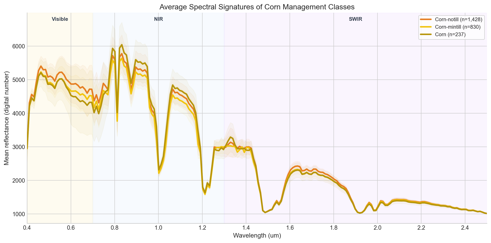

# Relatório

> [!CAUTION]
>
> - Você <ins>**não pode utilizar ferramentas de IA para escrever este relatório**</ins>.

## Identificação

- **Nome**: Vitor Alexandre Arguilar
- **Cartão UFRGS:** 344617

## Dados utilizados

> [!IMPORTANT]
>
> - Os dados utilizados devem ser informados como **links** para as fontes originais.
> - Se houver mais de um conjunto de dados, liste todos separadamente.
> - Para cada conjunto de dados, inclua também uma **descrição curta** explicando os dados.

1. **Indian Pines**: `https://www.ehu.eus/ccwintco/index.php?title=Hyperspectral_Remote_Sensing_Scenes`
    * **Descrição curta**: É um dataset hiperspectral que consiste em uma imagem aérea, com 200 bandas por píxel. O dataset inclui os dados brutos para análise e um arquivo de ground truth, que informa a classe (entre 16 classes como alfalfa, milho, madeira, etc). 

## Código-fonte da visualização

> [!IMPORTANT]
>
> - Indique abaixo onde está, dentro deste repositório, o código-fonte usado para gerar a visualização.

- **Arquivo principal**: [Visualization notebook](config.json)

## Imagem da visualização gerada

> [!IMPORTANT]
>
> - Insira aqui uma imagem da visualização criada por você. Troque `imagem-da-visualizacao.png` pelo caminho correto do arquivo no repositório. 
> - Se você criou alguma visualização interativa, então descreva aqui como acessá-la. Por exemplo, se for uma página HTML, coloque o link, ou se for uma visualização 3D, descreva como compilar e executar o código. 

(Alguns resultados foram testados, mas a que julguei mais clara foi)

## Descrição da visualização

### Legenda (*caption*)

> [!IMPORTANT]
>
> - Escreva um texto curto explicando como interpretar a visualização. Descreva os elementos visuais, eixos, cores, símbolos ou interações relevantes.
> - Este texto seria a legenda (*caption*) que acompanharia a figura em uma publicação, por exemplo.

No gráfico é possivel ver a assinatura espectral média dos pixels de milho para diferentes técnicas de cultura. O eixo y representa a reflectância de determinada banda espectral, o eixo x representa a largura de onda da banda, e cada uma das curvas representa diferentes tipos de preparo do solo. No background foi inserido uma divisão do espectro de cores (visível, Near Infra Red e Short-Wave Infra Red).

### Conclusão demonstrada pela visualização

> [!IMPORTANT]
>
> - Escreva uma conclusão curta sobre os dados com base na visualização.
> - Explique qual insight, padrão ou tendência pode ser observado.

A partir deste gráfico conseguimos ter uma ideia de como os tipos diferentes de preparo do solo influenciam o milho, considerando que é proposto na literatura que certas faixas de onda indicam parâmetros fisiológicos da planta. Por exemplo, algumas das regiões do espectro visível (~0.45um e ~0.66um) são influenciados pelos níveis de clorofila da planta, enquanto regiões do SWIR como 1.4um e 1.9um indicam a umidade da planta ou se ela está sofrendo de estresse hídrico. 